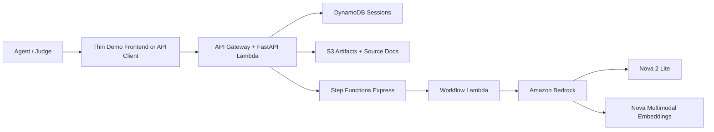

# LUCA

LUCA is an API-first reverse-engineering layer for agents. It takes a service URL and optional credentials, discovers usable endpoints and auth behavior, and generates a Python bundle that an agent can call directly.

For the demo, this repo also includes a thin frontend so judges can watch discovery, auth reasoning, and generated artifacts. The frontend is not the core product surface. The primary product surface is the backend API.

The full project story is in [docs/project-story.md](./docs/project-story.md).

## Architecture



## Required env vars

- `AWS_REGION`
- `LUCA_BEDROCK_TEXT_MODEL_ID`
- `LUCA_BEDROCK_EMBED_MODEL_ID`
- `LUCA_DDB_TABLE`
- `LUCA_ARTIFACTS_BUCKET`
- `LUCA_STATIC_BUCKET`
- `LUCA_CLOUDFRONT_DISTRIBUTION_ID`

Copy `.env.example` to `.env`.

## Local run

```bash
python -m venv .venv
source .venv/bin/activate
pip install -r requirements-dev.txt
uvicorn backend.app.main:app --reload
python -m http.server 4173 --directory frontend
```

Open `http://127.0.0.1:4173`.

## Deploy

```bash
sam build --template-file infra/template.yaml
sam deploy --guided --template-file infra/template.yaml
```

```powershell
./scripts/deploy_frontend.ps1 -BucketName <your-static-bucket> -ApiBaseUrl <your-api-url>
```
