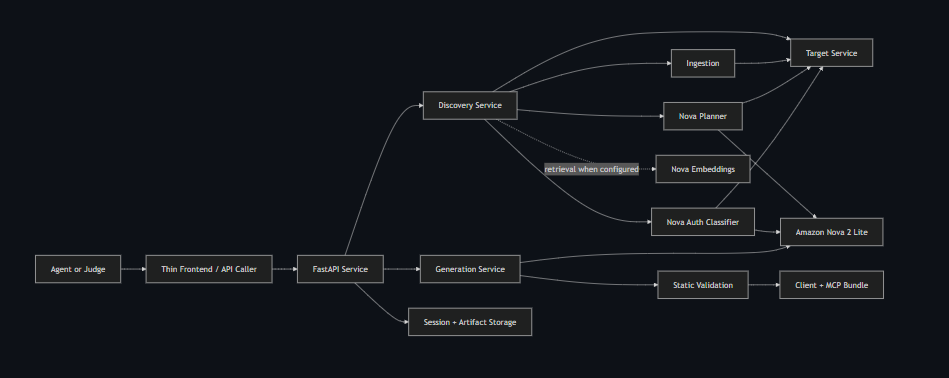
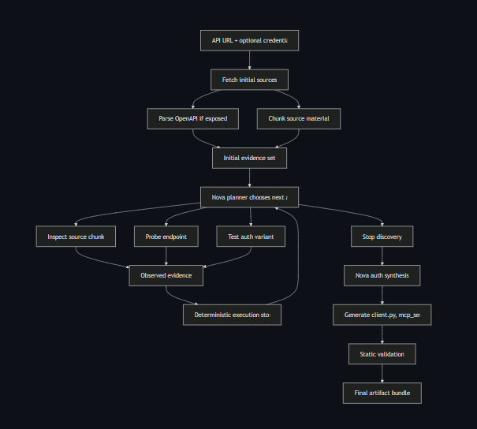

# LUCA

LUCA is an API-first reverse-engineering layer for agents. It takes a service URL and optional credentials, reconstructs usable endpoints and authentication behavior, and generates a Python bundle that an agent can call directly.

Amazon Nova sits at the center of that workflow. LUCA uses Nova to decide what evidence to inspect, which path to probe next, when to test an authentication variant, how to interpret auth signals, and how to generate the final bundle. The surrounding code handles execution, storage, parsing, and validation.

## System Architecture



LUCA is built as an API-first service. A user or agent sends a target URL and optional credentials to the backend, and LUCA opens a discovery session, stores the evidence it collects, and keeps track of the generated artifacts.

The important architectural choice is that Amazon Nova sits inside the main decision loop. After LUCA ingests source material from the target service, Nova decides what to inspect next, which endpoint to probe, when to test an auth variant, how to interpret the auth signals it sees, and how to generate the final client bundle. When embeddings are enabled, Nova embeddings can also help rank the most relevant source chunks during discovery.

## Reverse-Engineering Loop



LUCA starts with a target URL and whatever context is available, including optional credentials and any exposed source material. From there, it begins building an evidence set by fetching what it can see, parsing a spec if one exists, and turning the available material into something the model can reason over.

Once that evidence exists, Nova drives the loop. It decides whether LUCA should inspect a source chunk more closely, probe a specific endpoint, test an auth variant, or stop discovery because enough of the service has been reconstructed. Each action produces new evidence, and that evidence is fed back into the next decision.

That loop is what makes LUCA more than a parser. Instead of depending on a single source of truth, it can move through partial information and gradually reconstruct how a service works. When the loop ends, LUCA uses what it learned to synthesize auth behavior and generate the final client and server bundle.

## Environment

Copy [`.env.example`](./.env.example) to `.env`.

For the Nova-backed path, use:

```env
AWS_REGION=us-east-1
LUCA_RUNTIME_MODE=bedrock
LUCA_BEDROCK_TEXT_MODEL_ID=us.amazon.nova-2-lite-v1:0
LUCA_BEDROCK_EMBED_MODEL_ID=amazon.nova-2-multimodal-embeddings-v1:0
LUCA_STORAGE_MODE=memory
LUCA_ARTIFACT_MODE=local
LUCA_WORKFLOW_MODE=inline
LUCA_PUBLIC_BASE_URL=http://127.0.0.1:8000
```

The main env vars LUCA expects are:

- `AWS_REGION`
- `LUCA_BEDROCK_TEXT_MODEL_ID`
- `LUCA_BEDROCK_EMBED_MODEL_ID`
- `LUCA_RUNTIME_MODE`
- `LUCA_DDB_TABLE`
- `LUCA_ARTIFACTS_BUCKET`
- `LUCA_STATIC_BUCKET`
- `LUCA_CLOUDFRONT_DISTRIBUTION_ID`

## Bedrock Check

Before running LUCA, verify AWS credentials and Bedrock access:

```bash
aws sts get-caller-identity
python -c "import boto3; c=boto3.client('bedrock-runtime', region_name='us-east-1'); print(c.converse(modelId='us.amazon.nova-2-lite-v1:0', messages=[{'role':'user','content':[{'text':'Say hello in 3 words'}]}])['output']['message']['content'][0]['text'])"
```

If the second command fails with a Bedrock quota error, the AWS account needs usable Nova quota before LUCA can run live against Bedrock.

## Local Run

```bash
python -m venv .venv
source .venv/bin/activate
pip install -r requirements-dev.txt
uvicorn backend.app.main:app --reload
python -m http.server 4173 --directory frontend
```

Open `http://127.0.0.1:4173`.

## Tests

```bash
pytest -q
```

## Deploy

```bash
sam build --template-file infra/template.yaml
sam deploy --guided --template-file infra/template.yaml
```

## License

Apache 2.0. See [LICENSE](./LICENSE).
